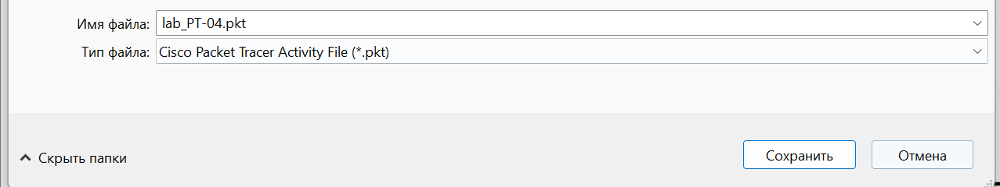
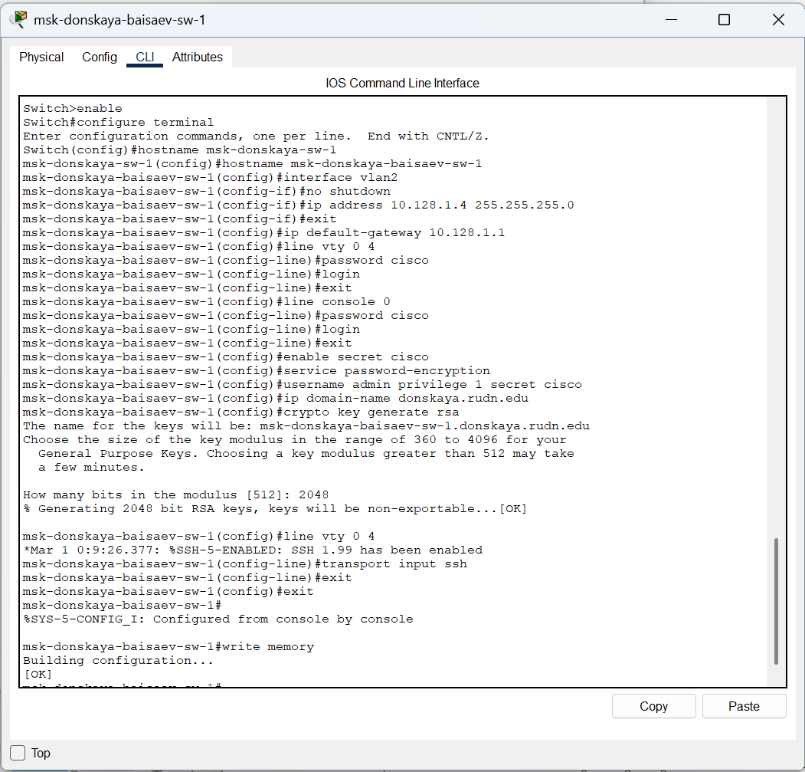
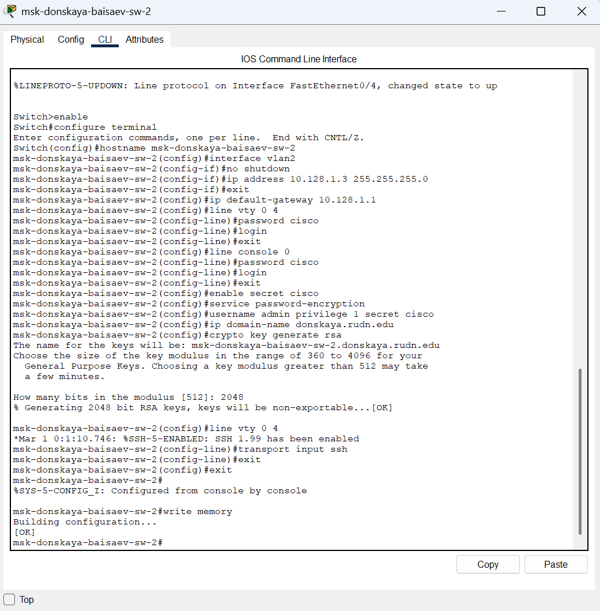
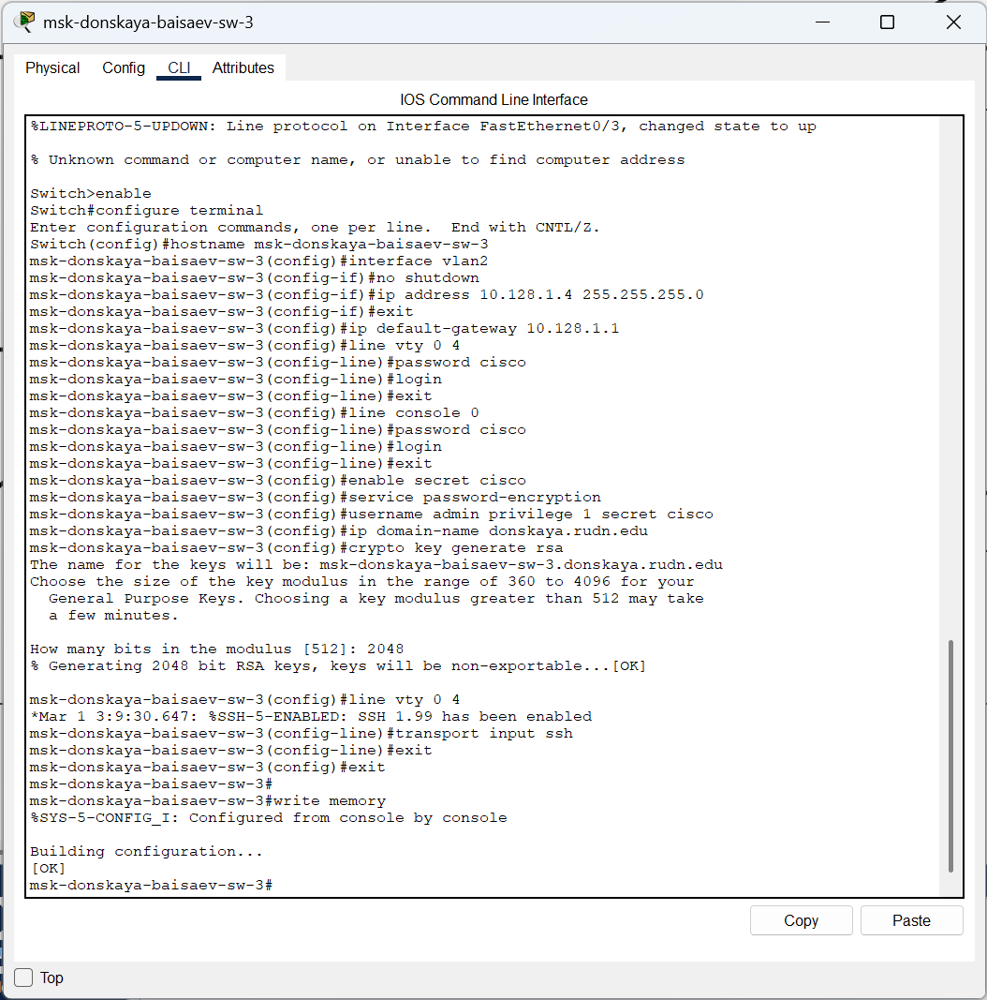
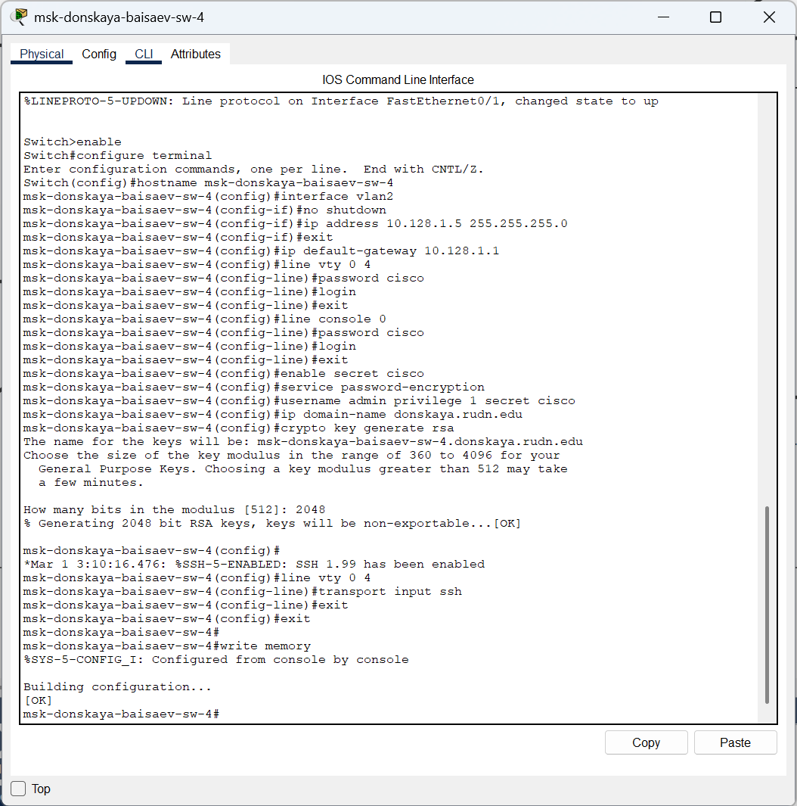
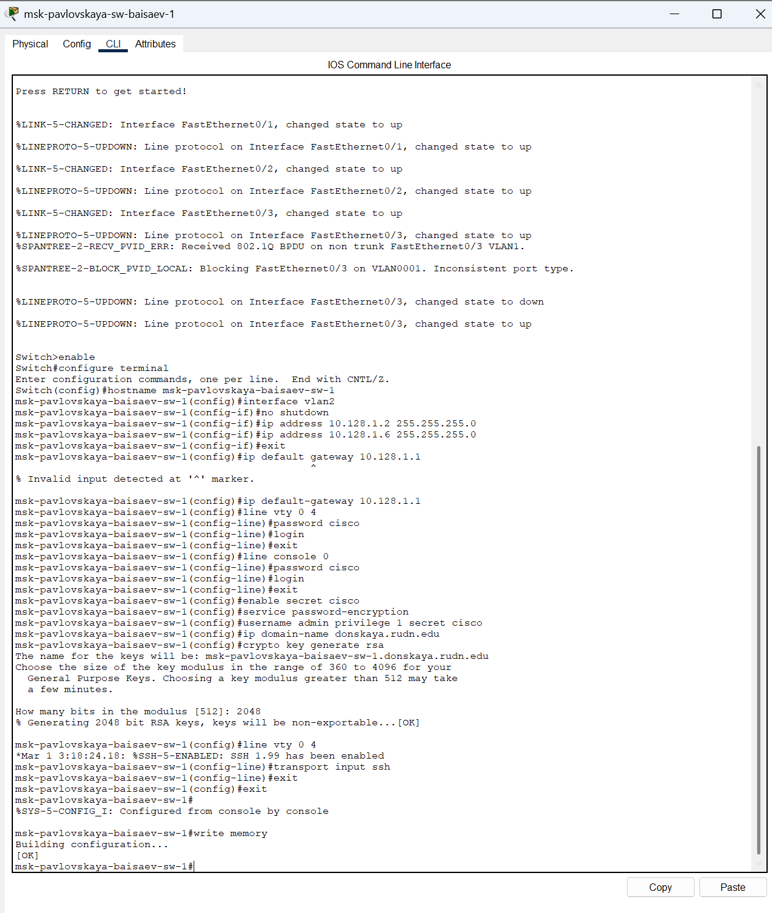

**РОССИЙСКИЙ УНИВЕРСИТЕТ ДРУЖБЫ НАРОДОВ** 

**Факультет физико-математических и естественных наук Кафедра теории вероятностей и кибербезопасности** 

**ОТЧЁТ** 

**ПО ЛАБОРАТОРНОЙ РАБОТЕ №4** 
*дисциплина: Администрирование локальных сетей* 

Студент: Исаев Булат Абубакарович Студ. билет № 1132227131 

Группа: НПИбд-01-22

**МОСКВА** 2025 г.

**Цель работы:** 

Провести  подготовительную  работу  по  первоначальной  настройке коммутаторов сети. 

**Выполнение работы:** 

Создадим новый проект с названием lab\_PT-04.pkt (Рис. 1.1):** 

**Рис. 1.1.** Создание нового проекта. 

В  логической  рабочей  области  Packet  Tracer  разместим  коммутаторы  и оконечные устройства согласно схеме сети L1 (схема приведена в лабораторной работе) и соединим их через соответствующие интерфейсы (Рис. 1.2):** 

**Рис. 1.2.** Размещение коммутаторов и оконченных устройств согласно схеме сети L1. 

Используя  типовую  конфигурацию  коммутатора,  настроем  все коммутаторы, изменяя название устройства и его IP-адрес согласно плану IP (Рис. 1.3 – 1.7): 

**Рис. 1.3.** Настройка коммутатора msk-donskaya-baisaev-sw-1, используя типовую конфигурацию. 

**Рис. 1.4.** Настройка коммутатора msk-donskaya-baisaev-sw-2, используя типовую конфигурацию. 

**Рис. 1.5.** Настройка коммутатора msk-donskaya-baisaev-sw-3, используя типовую конфигурацию. 

**Рис. 1.6.** Настройка коммутатора msk-donskaya-baisaev-sw-4, используя 

типовую конфигурацию. 

**Рис. 1.7.** Настройка коммутатора msk-pavlovskaya-baisaev-sw-1, используя 

типовую конфигурацию. 

**Вывод:** 

В  ходе  выполнения  лабораторной  работы  мы  научились  проводить подготовительную работу по первоначальной настройке коммутаторов сети. 

**Ответы на контрольные вопросы:** 

1. При помощи каких команд можно посмотреть конфигурацию сетевого оборудования? - **show running-config** 
1. При  помощи  каких  команд  можно  посмотреть  стартовый конфигурационный файл оборудования? - **show startup-config** 
1. При помощи каких команд можно экспортировать конфигурационный файл  оборудования?  -  **copy  running-config  startup-config/copy running-config flash** 
1. При помощи каких команд можно импортировать конфигурационный файл оборудования? - **copy startup-config running-config** 
9 
